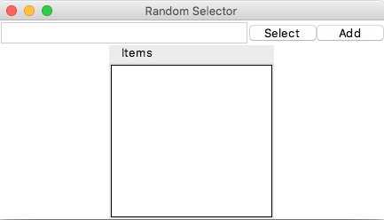
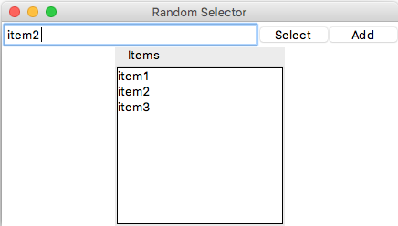
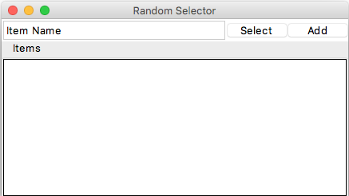

# tkouter

在過往的 GUI 程式設計中，製作 layout 往往是一件麻煩事。

1. 散落各處的元件及其擺放方式，難以讓設計師一目了然地想像和理解排版，我們只能透過實際運行 GUI 應用才能觀察到整體的佈局設計。
2. 其次，在代碼中，關於佈局的 **視圖邏輯**、處理使用者輸入與渲染的 **控制邏輯** 與 GUI 應用主要的 **計算邏輯**，完全混雜在一起，既不利於開發，也不利於維護修改。
3. 其三，缺乏統一性的方式可以對相關 GUI 元件進行屬性上的修改。

以上這些不足，在 Web 開發中，基於歷史發展的硬限制和逐步的改良加強，早就有了更方便的工具和解決方法: html、css 和模板語言的使用，能夠完全地切割視圖邏輯，能使設計單純化，也能使佈局一目了然；使用 MVC 設計架構的框架，能夠切割各種邏輯業務，使得設計更有彈性、更易維護。

基於以上需求和 Web 解決方案的啟發，tkinter 的擴充函式庫 - tkouter 誕生了，它支援使用者以 html 進行 layout 的設計。自此將視圖切割，並大幅度地簡化了設計的難度，更能以此為基礎，讓整體的設計趨近於 MVC 的原則。

## Contents

* [安裝](#安裝)
* [需求](#需求)
* [入門](#入門)

## 安裝

使用 `pip` 安裝是最方便的：

```sh
$ pip install tkouter
```

或也可以直接複製本專案：

```sh
$ git clone https://github.com/dokelung/tkouter.git
```

## 需求

* Python3.5 或更新的版本
* [Jinja2](http://jinja.pocoo.org/docs/2.10/)

## 入門

我們將會使用 [專案範例](demo) 中的 [隨機選擇器](demo/randsel) 來作為我們的第一個使用範例。這個隨機選擇器可以讓使用者自訂多個選擇項目，並且從中做出一個隨機的選擇。

P.S. 範例是什麼並不重要，重要的是了解 tkouter 的使用概念。

### 前置

1. 請確定已安裝了相容的 Python 版本及 tkouter 套件。
2. 在這份入門指引中我們會使用到兩個檔案，分別是描述佈局的 `randsel.html` 和元件實作所在的 `randsel.py`。
3. 請將上述兩個文件放置在同一個目錄下，如果你並沒有安裝 tkouter，而僅僅只是將之下載下來的話，請一並將 tkouter 套件目錄放置到同一個目錄中。

### 第一步：使用 html 來佈局視窗程式

一個基本的 tkouter 元件需要使用一個對應的 html 文件來描述佈局(layout)，下面是初始版本的佈局 html 及其對應的說明與實際視圖：

```html
<html>
    <head>
        <title> Random Selector </title>
    </head>
    <body>
        <left>
            <entry width="30" />
            <button width="8" text="Select" />
            <button width="8" text="Add" />
        </left>
        <top type="labelframe" text="Items">
            <listbox />
        </top>
    </body>
</html>
```

* 如同標準的 html 文件，我們在最外層要使用成對的 `<html>` 標籤夾住整份文件。

> 就如同標準的 html 文件一樣，`<html>` 下分別有成對的 `<head>` 標籤和 `<body>` 標籤，`<head>` 標籤不是每次都會出現的，只有當我們製作的 tkouter 元件是頂層元件時(其 parent 是 `TK`)才需要這個標籤。

* `<head>` 標籤用來設定一些 tkouter 的上層資訊，像是視窗名稱、選單資訊等。
* `<body>` 標籤用來佈局實際使用到的元件。
* `<title>` 標籤用來設定視窗的名稱。

> 要注意，若這個元件的 parent 不是 `TK` 的話，是不允許使用 `<title>` 的。

* `<top>` 標籤夾住的元件會由上至下擺置，而 `<left>` 標籤夾住的元件會由左至右擺置。

> tkouter 一共提供四種 `pack` 用的 **佈局標籤**，分別是 `<top>`, `<bottom>`, `<left>` 和 `<right>`，這四個標籤需要成對出現，會產生 `Frame` 元件來佈局其下的元件，我們也可以用 `type` 屬性指定其他的 frame 類別，例如此處的 `LabelFrame`。

* `<entry>`：會產生一個 `Entry` 元件，在這個例子中我們用 html 的標籤屬性 `width="30"` 來將該元件的長度設定為 30。
* `<button>`：會產生一個 `Button` 元件，我們在此一樣透過屬性設定其寬度與文字。
* `<listbox>`：會產生一個 `ListBox` 元件。

> 所有的 **元件標籤** 都支援非成對模式。而對於有 `text` 屬性的元件，tkouter 也支援成對的標籤，標籤中夾住的文字將會變成元件的 text 值。但在這個範例中，我們都使用顯性的 html 屬性 `text` 來設定元件的文字。

等等會產生的對應視圖如下：



### 第二步：實作自訂元件

接下來我們可以在 `randsel.py` 中實作我們的 GUI 元件：

```python
# randsel.py
from tkinter import Tk
from tkouter import *


class RandomSelector(TkOutWidget):

    # layout
    layout = 'randsel.html'

    def __init__(self, master):
        super().__init__(master)


if __name__ == '__main__':
    root = Tk()
    rs = RandomSelector(root)
    rs.pack()
    root.mainloop()
```

要使用 tkouter，務必先從其中匯入相關的類別和函式，我們這裡使用 `from tkouter import *` 來匯入所有可用類別和函式。

`TkOutWidget` 是 tkouter 中最重要的類別，所有的 tkouter 元件都需要繼承自此類別。其中，我們使用 class variable `layout` 來指定一個 html 文件用以描述該元件的 layout。除此之外，為了能夠順利地藉由 html 文件產生佈局，我們最好在 `__init__` 中顯性地呼叫 parent class 的 `__init__`。

> TkOutWidget 是 Frame 的子類別，所以任何的 tkouter 元件都能夠被當成一個獨立且符合 tkinter 規範的一般元件，這對於日後重複使用該元件有莫大的好處。

最後，我們一樣產生 `Tk` 實體，並生成 `RandomSelector` 的實例，簡單地 `pack` 後就能呼叫 `mainloop` 來啟動視窗程式了：

```sh
$ python randsel.py
```

### 第三步：實作元件功能

接著讓我們加入新的變數和函數來完成新增項目和隨機選擇的功能：

```python
# randsel.py
...
import random


class RandomSelector(TkOutWidget):

    # layout
    layout = 'randsel.html'

    # model
    item = StringField(default='Item Name')

    def __init__(self, master):
        super().__init__(master)
        self._items = []

    def select(self):
        if self._items:
            self.item = random.choice(self._items)

    def add(self):
        self._items.append(self.item)
        self.listbox.insert('end', self.item)
...
```

> 別忘了，為了使用 `random.choice`，我們要記得匯入 `random` 模組。

我們在 `RandomSelector` 中加入了一個 class variable `item`，它是 tkouter 中 `StringField` 的實例，我們等等會將它跟 `Entry` 元件進行綁定，用以讀寫 `Entry` 的值。

接著我們新增了一個 `self._items` 清單，他用來記錄使用者增加的各個項目。`select` 函數會從 `self._items` 中任意挑選一個項目並且寫入 `Entry` 元件中。`add` 函數則會透過 `self.item` 這個 string field 讀取 `Entry` 元件的值，並將之加入 `Listbox` 的尾端供使用者檢視。

> 我們緊接著會講到，為什麼我們在這裡可以使用 `self.listbox` 拿到對應的 `Listbox` 元件。

### 第四步：在佈局中使用元件屬性

接著我們來改良對應的 html 佈局：

```html
<html>
    <head>
        <title> Random Selector </title>
    </head>
    <body>
        <left>
            <entry width="30" textvariable="{self.item.var}" />
            <button width="8" text="Select" command="{self.select}" />
            <button width="8" text="Add" command="{self.add}" />
        </left>
        <top type="labelframe" name="itemframe" text="Items">
            <listbox name="listbox" />
        </top>
    </body>
</html>
```

在 tkouter 的 html 佈局中，我們可以用大括號 `{}` 來使用 tkouter 元件的屬性。在這裡，我們就用 `command={self.select}` 來將按鈕對應到的 `command` 設為 `RandomSelector` 中的方法 `select`，`self` 指的是 tkouter 元件 `RandomSelecotr` 實例本身。

> 在 html 佈局中的大括號裡，預設可以用的物件是 `self`，也就是元件本身，透過 `.` 進行階層式的屬性存取，使得我們可以在佈局中使用元件的各種成員。

我們也為 `<top>` 標籤和 `<listbox>` 標籤增加了 `name` 這個屬性，這讓我們可以在 `RandomSelector` 中可以使用 `self.itemframe` 和 `self.listbox` 來存取這兩個元件。這也是為什麼我們能使用 `self.listbox.insert('end', self.item)` 的原因了。

> 對於沒有給定 `name` 屬性的元件標籤，tkouter 也會自己幫該元件取一個名字，並且用這個名字產生一個對應的實例變數，而該變數參考到這個標籤元件。

最後，為了將 `Entry` 元件的值與 string field `self.item` 進行綁定，我們使用了 `textvariable` 屬性來指定相應的變數。在 tkouter 提供的 field 中，都有一個屬性 `var`，對應到 tkinter 提供的四種型態變數之一。總而言之，若我們想要將某元件與指定 field 進行綁定，我們應在大括號中指定 field 的 var 屬性。

完成後我們可以來測試一下基礎的功能，比如說利用 add 按鈕加入若干個項目，並且使用 select 按鈕從中選取一個：



### 第五步：調整佈局

這個步驟中我們將使用特殊的 `pack` 屬性來調整佈局：

```html
...
        <top type="labelframe" name="itemframe" text="Items" pack-fill="both" pack-expand="1" >
            <listbox name="listbox" pack-fill="both" pack-expand="1" />
        </top>
    </body>
...
```

在 tkouter 的 html 佈局中我們可以利用帶有前綴 `pack-` 的特殊屬性來調整佈局的樣式，在這裡我們使得 `LabelFrame` 元件和 `Listbox` 元件在 `pack` 的時候，使用指定的 option： `fill="both"` 和 `expand=1`。

> 使用帶有前綴的特殊標籤屬性，是為了區隔 **元件屬性設定** 和 **佈局元件的行爲**。

調整完的樣子如下：



### 第六步：加入菜單

在 tkouter 中加入菜單(menu) 是很容易的事情：

```python
...
class RandomSelector(TkOutWidget):

    # layout
    layout = 'randsel.html'

    # model
    item = StringField(default='Item Name')
    hide = BoolField(default=False)

    def __init__(self, master):
        super().__init__(master)
        self._items = []

    def select(self):
        if self._items:
            self.item = random.choice(self._items)

    def add(self):
        self._items.append(self.item)
        self.listbox.insert('end', self.item)

    def show(self):
        if self.hide:
            self.itemframe.pack_forget()
        else:
            self.itemframe.pack(fill="both", expand="1")

    def quit(self):
        self.master.destroy()
...
```

我們加入了 `hide` 這個布林的欄位，還有另外兩個方法： `show` 和 `quit`。`show` 會根據 `hide` 欄位的值決定是否隱藏 `Listbox` 元件，而 `quit` 方法是用來結束 tkinter 應用的。

```html
...
    <head>
        <title> Random Selector </title>
        <menu>
            <menu label="Command" underline="0">
                <command command="{self.select}"> Select </command>
                <command command="{self.add}"> Add </command>
                <separator />
                <command command="{self.quit}"> Quit </command>
            </menu>
            <menu label="View" underline="0">
                <checkbutton label="Hide items" onvalue="1" offvalue="0" variable="{self.hide.var}" command="{self.show}" />
            </menu>
        </menu>
    </head>
...
```

我們使用 `<menu>` 標籤來加入菜單，多層的 `<menu>` 標籤可以自動產生多級的菜單，該標籤底下可以放置菜單元件標籤，在這裡 `<command>` 標籤我們首次採用對稱式的標籤寫法來指定菜單元件的 `label` 內容。

這裡我們也為了要將 `CheckButton` 元件與 `hide` 欄位綁定，使用了 `variable="{self.hide.var}"` 的寫法。

菜單如圖示：


